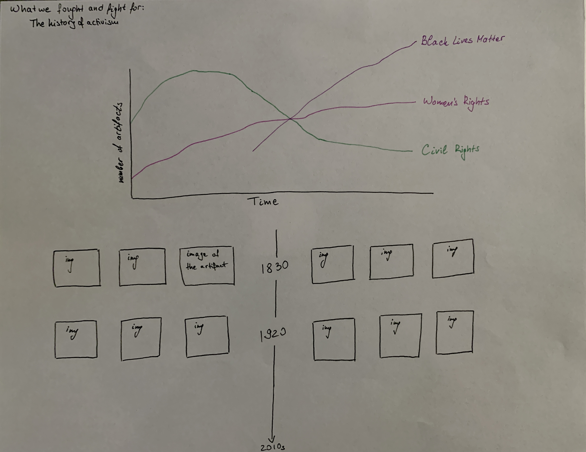
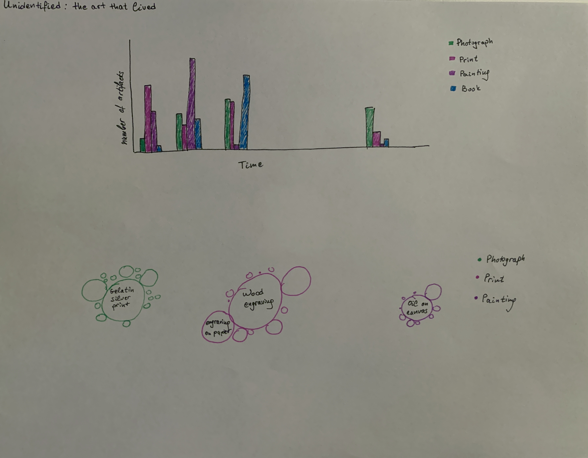
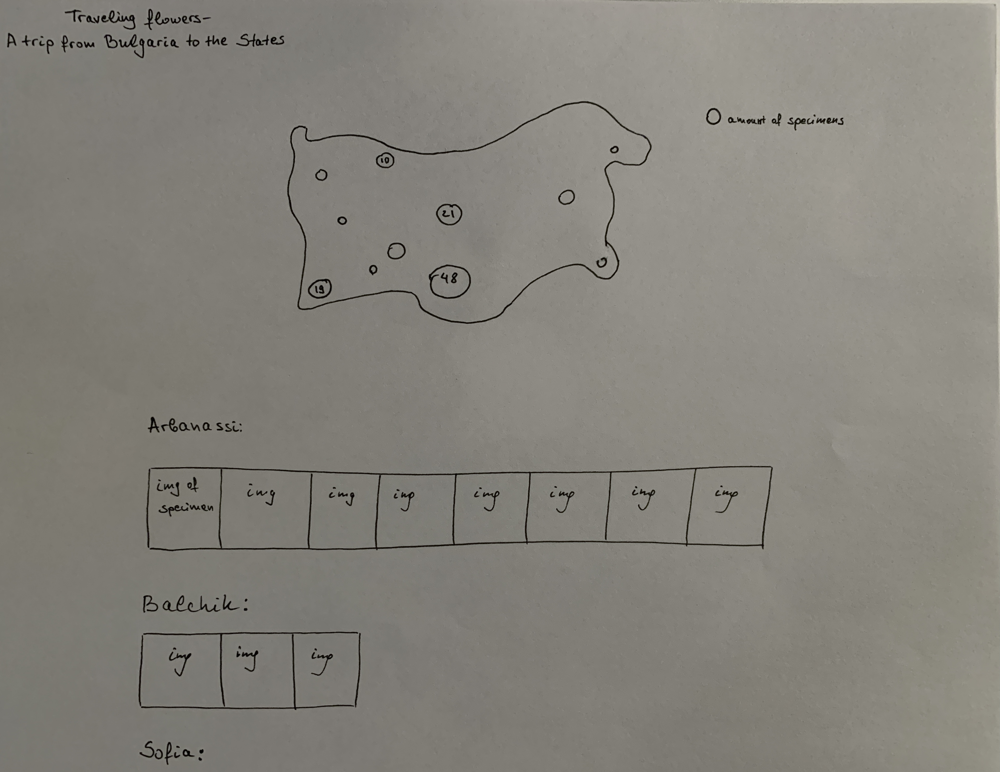

## Quantitative

Assignment 1: 01B Concept & Sketches

#### Idea 1: 

### What we fought and fight for:  the history of activism 

Questions I want to explore: 
What historic movements associated with activism have taken place throughout history? What ephemeral artifacts, such as posters and pamphlets, have we preserved in museums? How has the imagery evolved throughout time?

Dataset: "Memorabilia and Ephemera-Political and Activist Ephemera"

Amount of data: 169 documents with CC0 online media, dating 1830s-2010s

Properties of the data: Title, Place, Date, Topic, Movement, Type

Visualization method used: Multiline chart, Timeline of the images

The first project idea I have is to visualize the available records for Memorabilia and Ephemera-Political and Activist Ephemera. What interests me in this project is the possibility to explore, analyze and visualize how many artifacts on the topic are available in the Smithsonian Institution's museums, and with what movements/protests they are associated with. I would like to visualize the number of the artifacts throughout time, grouped by movement. I am using a multiline chart, so comparisons between the quantity of collected items from each movement can be made. This topic excites me as the topics that engaged the public a hundred years ago are still relevant today. I would also want to expose the images of the artifacts with the respective time period when they were created so users can explore them and visually compare them. 

#### Idea 2: 

### Unidentified: the art that lived

Questions I want to explore: What is the type of art in the museums with unidentified artists? Is there a prevalence in one medium vs another? Is there a correlation between the year in which the artifact was produced, the medium and the number of artifacts from unidentified artists?

Dataset: "unidentified artist"

Amount of data: 1,112 documents with CC0 online media, dating 1580s-1970s

Properties of the data: Title, Type, Medium, Date, Topic

Visualization method used: Grouped bar chart, Bubble chart

While exploring different ideas and reviewing the artifacts available in the Smithsonian Institution museums, I noticed records of art with unidentified artist. This made me ask myself why is this happening and can we actually find the answer in the data itself. I would like to visualize this with a grouped bar chart, representing the different media used to create the art and the time period when it was created. This visualization will be supplemented with a bubble chart, showing the distribution of  mediums used, classified by their granular level, e.g. general type: print, medium: wood engraving. The combination of these visualizations will allow me to discover if there is a relationship between the medium, time period and the author being unidentified.

#### Idea 3: 

### Traveling flowers - a trip from Bulgaria to the States

Questions I want to explore: What types of plants traveled 10,000 kilometers from Bulgaria to USA? Where do they originate from? How many types of plants were collected from those regions? Is there a specific region which provided most of those artifacts?

Dataset: "Bulgaria Dicotyledonae"

Amount of data: 701 documents with CC0 online media, dating 1800s-2000s

Properties of the data: Name, Place, Collector, Collection Date, Taxonomy

Visualization method used: Bubble Map 

Out of curiosity I wanted to explore if there were any artifacts from Bulgaria in any of the Smithsonian Institution museums. To my surprise, there were more than 800 results with free media, most of which were plants. After further exploration of the results, I found that some of these plants were actually obtained in the 1800s. What types of plants would travel 10,000 kilometers from a Bulgarian mountain to an American museum? I hope my visualization can explore this and other questions, and provide clarity if there is a specific region from which most of those plants originate. I want to represent the data with a bubble map and expose the pictures of the artifacts associated with their region below. 