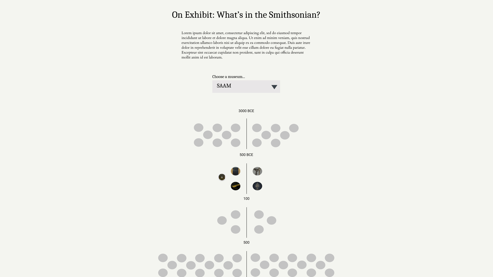

#### 02B Design mockup and first prototype

The project I selected is "***On Exhibit: What's in the Smithsonian?***". Many items are collected by museums all over the world, but physical and other constraints allow only small part of artifacts to be exhibited for the public. What are these artifacts in the Smithsonian? This visualization represents the artifacts using a time-driven beeswarm, and exposing the images in the visualization circles. The user can choose a museum to explore with a dropdown, and see everything available in that museum (based on the data in the API) chronologically. This not only allows users to see the subset of artifacts that are displayed in the physical space of the museums, but also get to explore virtually a subset of these same artifacts, effectively creating an online tour of the museum - something ever more important in the times of COVID where a lot constraints exist on public gatherings.

**Questions I want to explore**: What is on exhibit? What are those artifacts that made it into the museums' galleries? How do they represent human history?

**Dataset**: on exhibit = "Yes"

**Amount of data**: 3,302 documents with CC0 media, dating BCE 3000s to 2010s

**Visualization method used**: Beeswarm with images

##### Design mockup
Starting with the initial sketch on paper, I created the high-fidelity sketch in Figma. The visualization represents each artifact in a museum as a beeswarm. Each circle is one artifact, falling in the time period indicated in the Open Access API. The circles contain the item's image, so the viewer can explore the collection of exhibited items in the museum, which are with CC0 media and available in the API. On top of the beeswarm, the user can select the museum they want to explore from a drop-down, which is provided a default value.

##### Code prototype
The code prototype is implemented in JavaScript according the starter code provided in class. It makes an initial API request which gathers information about the number of rows available for the search query. The row count is then used to calculate the number of API requests needed, as the rows are limited to 1000 per page in the API documentation. Next, I fetch all the data and filter the API response only to the data I will need for my visualizations. The data is then structured into an empty array of objects. Finally, I feed the array data into a 'pre' tag and display it in the HTML. A button is included to indicate when the data arrives due to the amount of datapoints in the final dataset. Once the data are ready, the button prompt changes, and once cliked, it downloads a JSON of the curated dataset.

