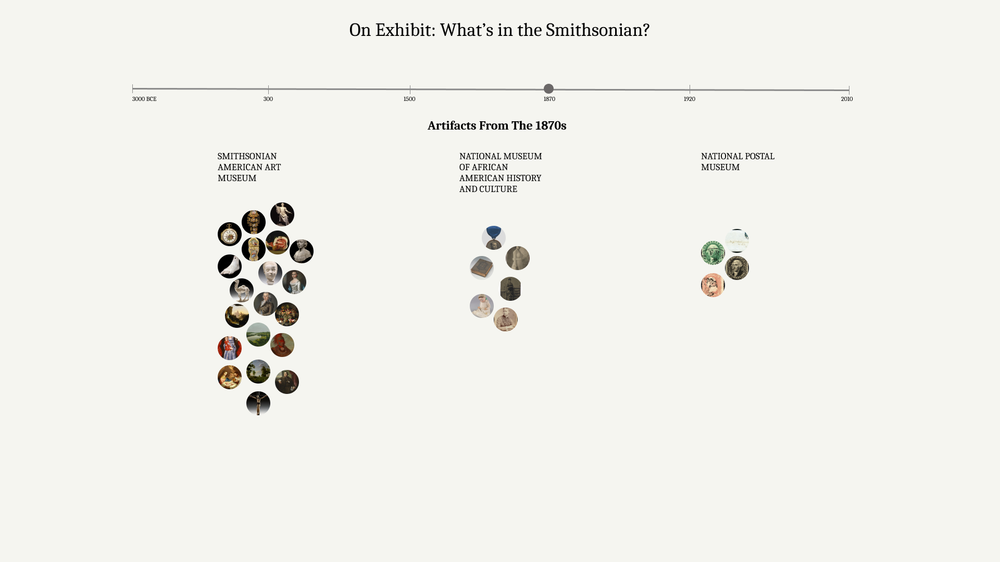

## Interactive

### On Exhibit: What is in the Smithsonian?

For the interactive project, I want to introduce two new features to the qualitative ***On Exhibit: What's in the Smithsonian?*** project. Currently, it has a summarized view, indicating the time periods for which each museum has collected artifacts on exhibit, as well as a detailed view, in which the user can select a specific museum and explore all exhibited artifacts from it on a timeline with their images. 

- The first suggested view would incorporate the two current features and provide the user the ability to compare the museums, but in a more detailed way. The visualization includes a slider, which allows selection of a specific time period. Once the time period is selected, the user can see all artifacts for it, grouped by the museum which holds them. This way the viewer can explore what was collected at different times throught all museums in the Smithsonian Institution and make comparisons. 

- The second proposed feature is an exhibition which presents images of different artifacts to the user, as well as the ability to re-generate the exhibition. This allows exploration at a different level, letting the user view "samples" of the museums.

