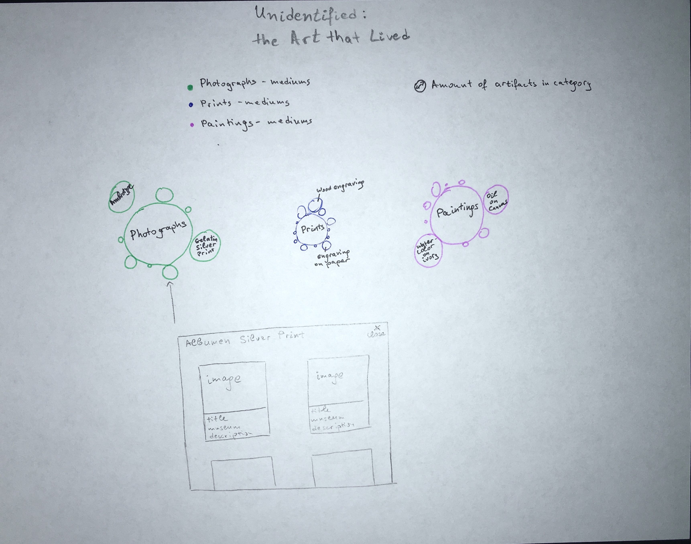

## Qualitative

Assignment 2: 02A Concept & Sketches

#### Idea 1: 

### Unidentified: the art that lived

Questions I want to explore: What is the type of art in the museums with unidentified artists? Is there a prevalence in one medium vs another? Is there a correlation between the year in which the artifact was produced and the type of medium used by the unidentified artist?

Dataset: "unidentified artist"

Amount of data: 1,120 documents with CC0 online media, dating 1580s-1970s

Visualization method used: Bubble chart with color coded categories and expandable modal with images for each category 

While exploring different ideas and reviewing the artifacts available in the Smithsonian Institution museums, I noticed records of art with unidentified artist. This made me ask myself why is this happening and can we actually find the answer in the data itself. I would like to visualize this with a  bubble chart, showing the distribution of mediums used, classified by their granular level, e.g. general type: print, medium: wood engraving. Additionally, on click of the bubble (group), a modal is exposed, where users can explore all artifacts within the category with their images and metadata.

#### Idea 2: 

### Smithsonian's Jewels

Questions I want to explore: What jewelry is collected in the Smithsonian institution museums? How does it look? How did jewelry change over time?

Dataset: type: Jewelry

Amount of data: 1,743 documents with CC0 media, dating BCE 5000s - 1950s

Visualization method used: Timeline with images

As jewelry is always part of each museum's exhibit, I wanted to explore Smithsonian's collection and study how jewelry has changed over time. Since the dataset contains artifacts dating 5000 years BC, this is an amazing opportunity to visualize jewelry for a great part of the history of human kind we have access to. I will visualize the data in a vertical timeline, with all images for the time period on the two sides of the time vertical.

#### Idea 3: 

### On Exhibit: What is in the Smithsonian?

Questions I want to explore: What is on exhibit? What are those artifacts that made it into the museums' galleries? How do they represent human history?

Dataset: on exhibit = "Yes"

Amount of data: 3,302 documents with CC0 media, dating BCE 3000s to 2010s

Visualization method used: Beeswarm with images

Many items are collected by museums all over the world, but physical and other constraints allow only small part of artifacts to be exhibited for the public. What are these artifacts in the Smithsonian? This visualization represents the artifacts using a time-driven beeswarm, and exposing the images in the visualization circles. The user can choose a museum to explore with a dropdown, and see everything available in that museum (based on the data in the API) chronologically. This not only allows users to see the subset of artifacts that are displayed in the physical space of the museums, but also get to explore virtually a subset of these same artifacts, effectively creating an online tour of the museum - something ever more important in the times of COVID where a lot constraints exist on public gatherings. 
