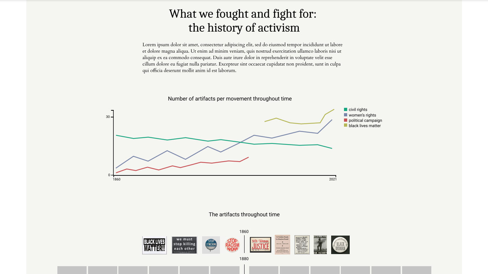

#### 01C Design mockup and first prototype

The project I selected is "***What we fought and fight for: the history of activism***". What interests me in this project is the possibility to explore, analyze and visualize how many artifacts on the topic are available in the Smithsonian Institution's museums, and with what movements/protests they are associated with. I would like to visualize the number of the artifacts throughout time, grouped by movement/topic. I am using a multiline chart, so comparisons between the quantity of collected items from each movement/topic can be made. This topic excites me as the topics that engaged the public a hundred years ago are still relevant today. I would also want to expose the images of the artifacts with the respective time period when they were created so users can explore them and visually compare them.

**Questions I want to explore**: What historic movements/topics associated with activism have taken place throughout history? What ephemeral artifacts, such as posters and pamphlets, have we preserved in museums? How has the imagery evolved throughout time?

**Dataset**: "Memorabilia and Ephemera-Political and Activist Ephemera"

**Amount of data**: 170 documents with CC0 online media, dating 1830s-2010s

**Properties of the data**: Title, Place, Date, Topic, Movement, Type

**Visualization method used**: Multiline chart, Timeline of the images

##### Design mockup
Starting with the initial sketch on paper, I created the high-fidelity sketch in Figma. The multiline chart represents the different movements/topics the artifacts were created for. The x axis represents the time period in which they were created, and the y axis represents the amount of artifacts for the time period. Each line groups the artifacts according the movement they were created for.
The second visualization is a vertical timeline, where the images of the artifacts are displayed according the time of their creation. 

<<<<<<< HEAD

=======

>>>>>>> 1991f71... add API request code and high-fidelity sketch

##### Code prototype
The code prototype is implemented in JavaScript according the starter code provided in class. It makes an initial API request which gathers information about the number of rows available for the search query. The row count is then used to calculate the number of API requests needed, as the rows are limited to 1000 per page in the API documentation. Next, I fetch all the data and filter the API response only to the data I will need for my visualizations. The data is then structured into an empty array of objects. Finally, feed the array data into a 'pre' tag and display it in the HTML. 

